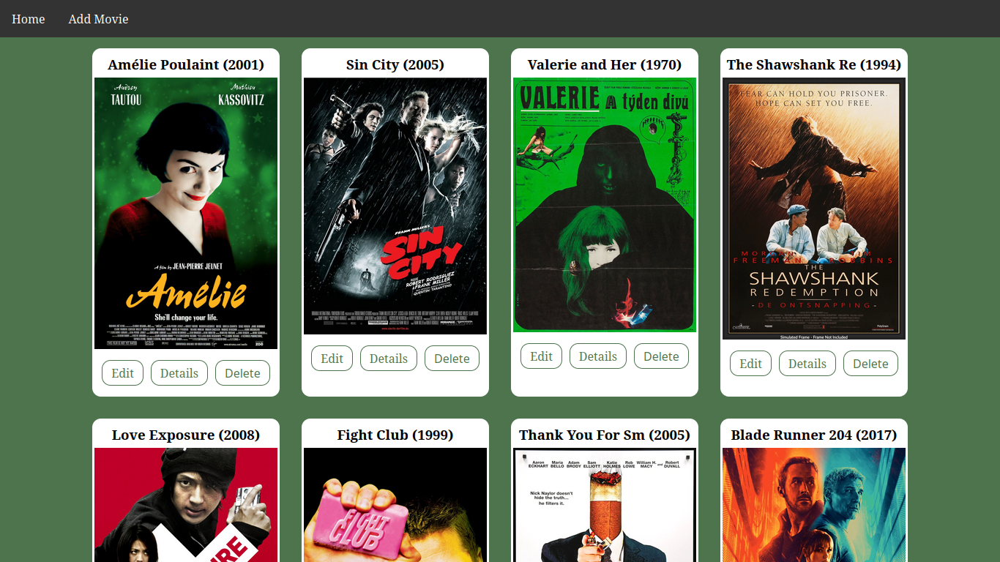
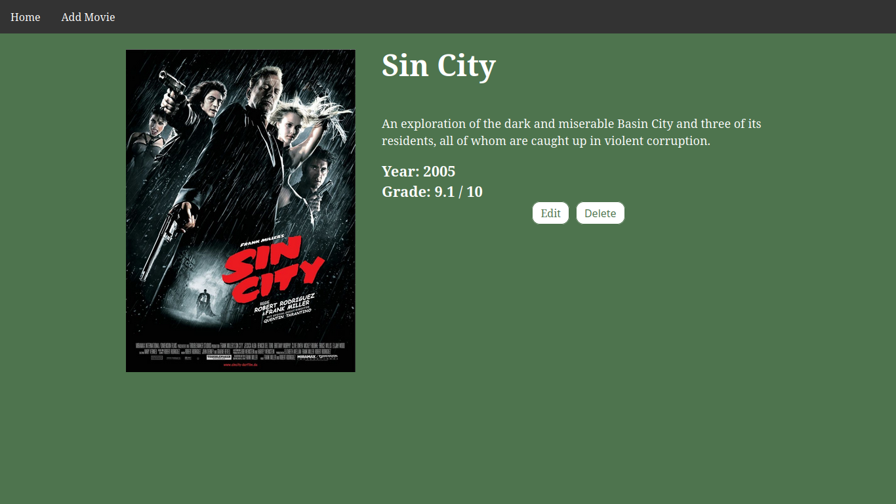

# Crud
A simple crud made with JS and JSON. You can Create, Read, Update and Delete movies from the catalog, also see the details on a diferent page.
<p align="center">
    
    
    
</p>

## Install

```
npm init -y
```
```
npm install nodemon --save-dev
```
```
npm install --save express body-parser ejs
```
```
npm start
```
